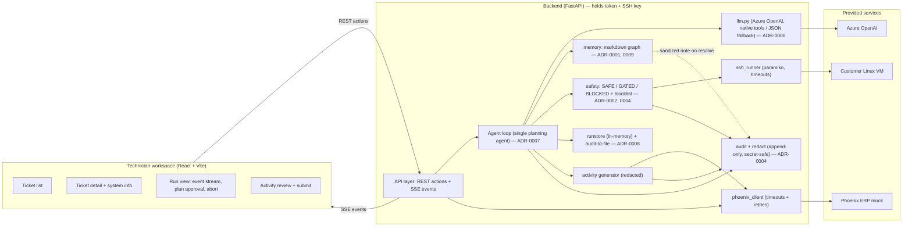
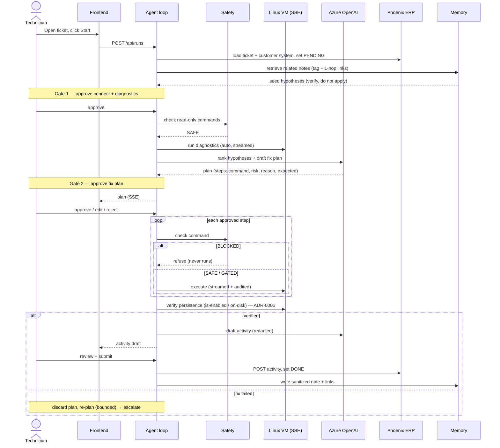
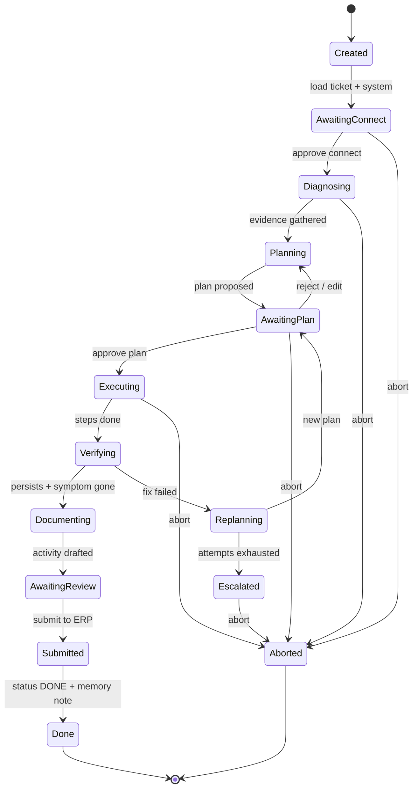
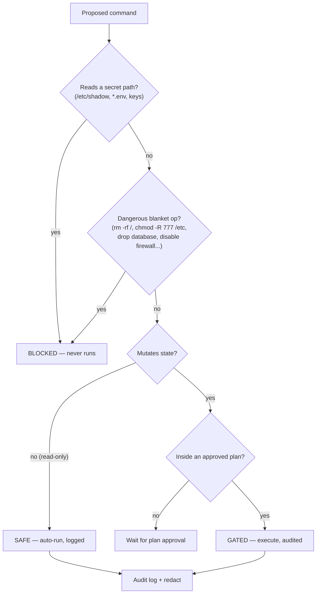

# Architecture

Visual overview of the AI Service Desk Autopilot. Vocabulary is defined in
[`../CONTEXT.md`](../CONTEXT.md); the rationale behind each choice is in
[`adr/`](adr/). Diagrams are Mermaid — they render on GitHub and in VS Code.

---

## 1. Components

A thin React workspace over a FastAPI backend that orchestrates a human-in-the-loop
troubleshooting loop. The backend is the **only** holder of the ERP token and SSH key —
the browser never sees them. Events stream to the UI over SSE; technician actions are
REST POSTs (ADR-0008).

---

## 2. Run loop (sequence)

Two approval gates: **connect + diagnose**, then the **fix plan**. SAFE reads auto-run;
GATED commands run only inside an approved plan; BLOCKED never runs. Memory pre-fills the
plan as *hypotheses to verify*, never as auto-actions (ADR-0009).

---

## 3. Run state machine

---

## 4. Command safety tiers

Every proposed command passes the safety layer before it can run. The model proposes;
code disposes (ADR-0002, ADR-0004).

